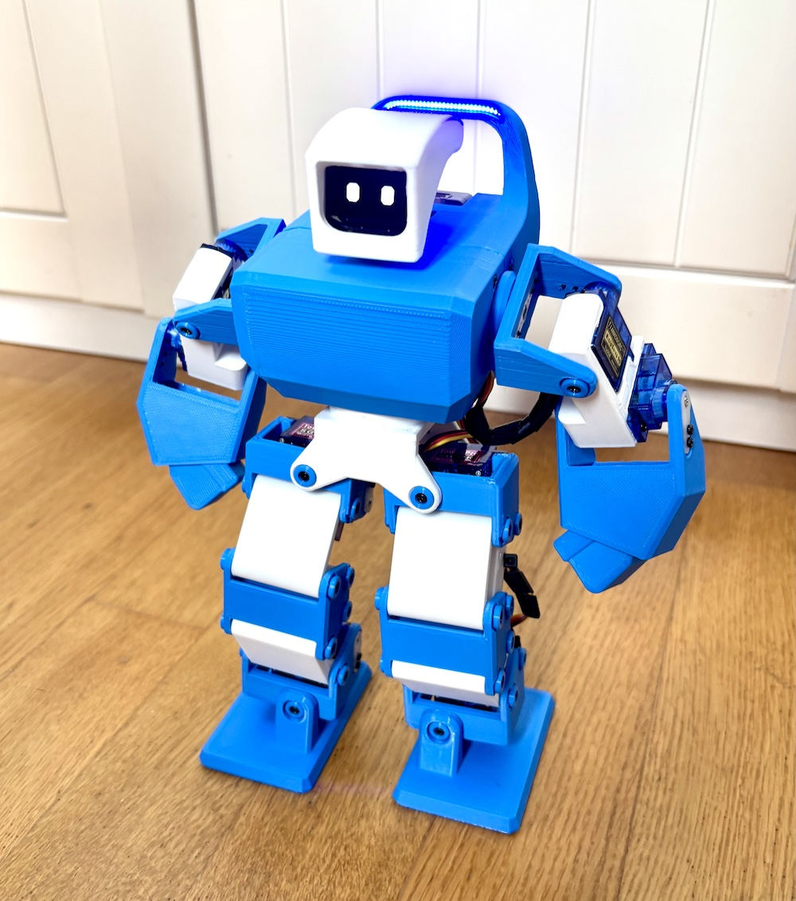
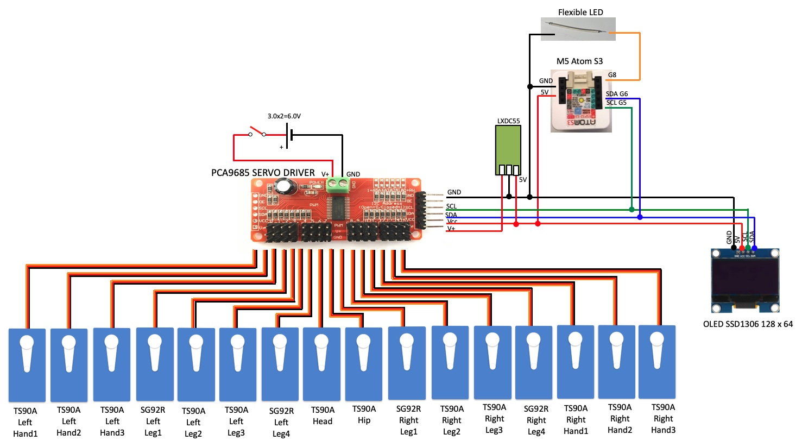
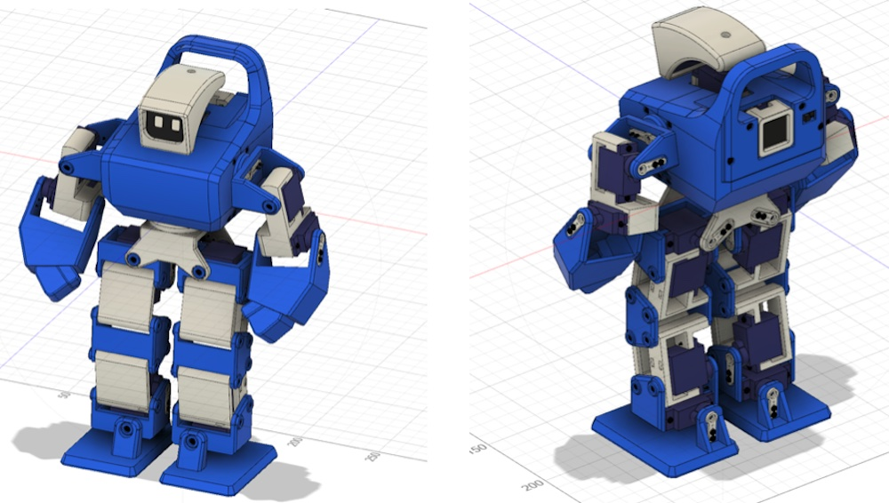

# NX25

I made biped robot with M5 Atom S3   
The basic concepts are:  
- Simple and cheep as much as possible  
-  Cute and Cool  
-  16 axis  

[Summary]
http://robo-takao.jp/NX25/e/index.html

[Movie]  
https://youtu.be/rR1G2fjKznk?si=v_UU0EfXKI9O3Kt_

[Components]  
1)M5 Atom S3  
2)PCA9685 Servo Driver  
3)Servos TS90A x12 SG92R x4  
4)OLED SSD1306 128x64  
5)Lithium Ion Battery with step down converter 3.0V x2  
6)Power Converter LXDC55  
7)Flexible LED (Blue)  

[Connection]  

[3D model]  

[Functions]  
Walk Forward, Back  
Turn Right, Left  
Side Slide Walk Right, Left  
Punch Right, Left  
Control via JoyC (Joy stick with M5stickC)  
Hands motion by JoC  
Face action (eyes motions)  
Blue Light by flexible LED  

[Code]  
M5M5AtonS3
 NX25_M5AtomS3_JoyC_ik  
M5StickC with JoyC
 NX25_M5StickC_joyC 
